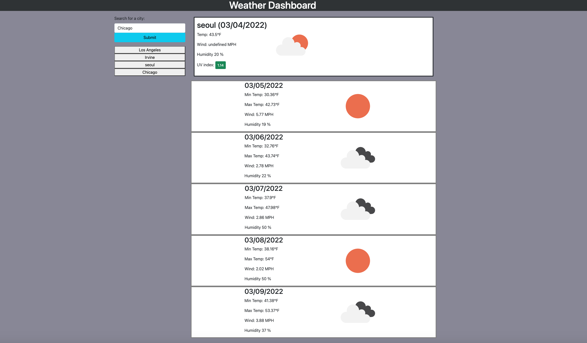

# WEATHER DASHBOARD
```
The function of this app is to provide the user with the current weather, along with the weather for the next five days. The weather information included consists of the following: temperature, wind speed, humidity, and UV index. There will also be a weather icon for each day. The UV index is color-coded by severity. The user can search for the city he wants to check the weather in and the app will backlog the history of his searches, creating buttons for each city's input. When he clicks on those buttons, the weather information for those city will display again. 


```
## ALGORITHM 
```

1. Set up a basic HTML and CSS page to begin the project
2. Set up basic JS to begin the project
3. Connect APIs 
4. Build Carousel funcionality
5. Build search bar funcionality w/ API
```

## LINK TO DEPLOYED APP 



